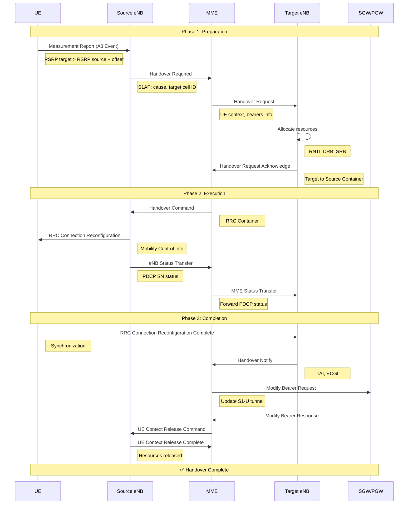

# S1 Handover Sequence Diagram

## Sequence Diagram (Mermaid)



## S1AP Messages

### HandoverRequired (Source eNB → MME)

| IE | Description |
|----|-------------|
| MME-UE-S1AP-ID | UE ID on MME side |
| eNB-UE-S1AP-ID | UE ID on eNB side |
| Cause | Handover reason (radio, resource, etc.) |
| Target ID | Target cell (TAI + ECGI) |
| Source-ToTarget-TransparentContainer | RRC context |

### HandoverRequest (MME → Target eNB)

| IE | Description |
|----|-------------|
| MME-UE-S1AP-ID | UE ID on MME side |
| Handover Type | intraLTE, LTEtoUTRAN, etc. |
| Cause | Handover reason |
| UE Aggregate Maximum Bit Rate | QoS |
| E-RAB To Be Setup List | Bearers to establish |
| Source-ToTarget-TransparentContainer | RRC context |
| Security Context | Keys, algorithms |

### HandoverRequestAcknowledge (Target eNB → MME)

| IE | Description |
|----|-------------|
| MME-UE-S1AP-ID | UE ID on MME side |
| eNB-UE-S1AP-ID | New ID assigned by target eNB |
| E-RAB Admitted List | Accepted bearers |
| Target-ToSource-TransparentContainer | RRC HO Command |

### MMEStatusTransfer (MME → Target eNB)

| IE | Description |
|----|-------------|
| eNB Status Transfer | PDCP SN status (UL/DL) |

### HandoverNotify (Target eNB → MME)

| IE | Description |
|----|-------------|
| MME-UE-S1AP-ID | UE ID |
| TAI | Tracking Area Identity |
| EUTRAN-CGI | Cell Global Identity |

## 3GPP Timers

| Timer | Default Value | Description |
|-------|---------------|-------------|
| TS1RELOCprep | 10s | Handover preparation |
| TS1RELOCoverall | 20s | Total handover duration |
| TRELOCprep | 1s | At eNB level |

## Measurement Events (A3)

### A3 Configuration

```
A3 Event: Neighbour > Serving + Offset
```

| Parameter | Typical Value | Description |
|-----------|---------------|-------------|
| a3_offset | 6 dB | Trigger margin |
| a3_hysteresis | 0-3 dB | Prevents ping-pong |
| time_to_trigger | 480 ms | Delay before trigger |
| report_type | RSRP | Measured metric |

### Trigger Formula

```
Mn + Ofn + Ocn - Hys > Ms + Ofs + Ocs + Off

Where:
  Mn = Neighbor measurement
  Ms = Serving measurement
  Ofn/Ofs = Frequency offset
  Ocn/Ocs = Cell offset
  Hys = Hysteresis
  Off = A3 Offset
```

## 3GPP References

- **TS 23.401** § 5.5.1 — S1-based Handover
- **TS 36.413** § 8.4 — Handover Signalling
- **TS 36.331** § 5.5.4 — Measurement Configuration
- **TS 36.133** § 8.1.2 — A3 Event Requirements
