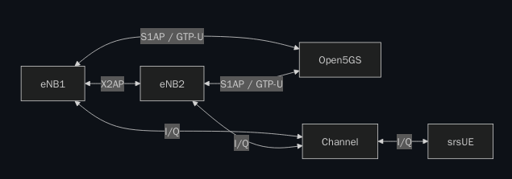

# Complete Setup Guide

This document contains all the configuration details needed to replicate the S1 Handover VoLTE lab.

## Architecture Overview



```
┌─────────┐    X2AP     ┌─────────┐
│  eNB1   │◄───────────►│  eNB2   │
│ PC1     │             │ PC2     │
└────┬────┘             └────┬────┘
     │                       │
     │ S1AP / GTP-U          │ S1AP / GTP-U
     │                       │
     └───────────┬───────────┘
                 │
          ┌──────┴──────┐
          │   Open5GS   │
          │  Core + IMS │
          └─────────────┘
```

## Network Configuration

### IP Addressing

| Component | IP Address | Interface |
|-----------|------------|-----------|
| PC1 (eNB1) | 192.168.1.100 | eth0 |
| PC2 (eNB2) | 192.168.1.101 | eth0 |
| MME (macvlan) | 192.168.1.102 | macvlan |
| Docker Network | 172.22.0.0/24 | br-ogstun |

### Docker Containers

| Container | IP (Docker) | Port | Role |
|-----------|-------------|------|------|
| mme | 172.22.0.9 | 36412 (SCTP) | Mobility Management Entity |
| hss | 172.22.0.3 | 3868 | Home Subscriber Server |
| pcrf | 172.22.0.4 | 3868 | Policy and Charging Rules |
| sgwc | 172.22.0.5 | 2123 | Serving Gateway Control |
| sgwu | 172.22.0.6 | 2152 | Serving Gateway User |
| smf | 172.22.0.7 | 2123 | Session Management |
| upf | 172.22.0.8 | 2152 | User Plane Function |
| pcscf | 172.22.0.21 | 5060 | Proxy-CSCF |
| icscf | 172.22.0.19 | 5060 | Interrogating-CSCF |
| scscf | 172.22.0.20 | 5060 | Serving-CSCF |
| rtpengine | 172.22.0.16 | 2223 | RTP Media Relay |
| asterisk | 172.22.0.23 | 5060 | PSTN Gateway |

## Subscriber Configuration

### Subscriber 1 (Phone 1)

```yaml
IMSI: 001010000123451
MSISDN: 1001
K: 465B5CE8B199B49FAA5F0A2EE238A6BC
OPC: E8ED289DEBA952E4283B54E88E6183CA
AMF: 8000
SQN: 000000000000

APN Configuration:
  - Name: internet
    QCI: 9
    ARP: 8
  - Name: ims
    QCI: 5
    ARP: 1
```

### Subscriber 2 (Phone 2)

```yaml
IMSI: 001010000099901
MSISDN: 1099
K: 465B5CE8B199B49FAA5F0A2EE238A6BC
OPC: E8ED289DEBA952E4283B54E88E6183CA
AMF: 8000
SQN: 000000000000

APN Configuration:
  - Name: internet
    QCI: 9
    ARP: 8
  - Name: ims
    QCI: 5
    ARP: 1
```

### IMS Subscriber Data

```sql
-- HSS IMS Subscription (cx_hss database)
INSERT INTO imsu (id, name) VALUES (1, '001010000123451');
INSERT INTO imsu (id, name) VALUES (2, '001010000099901');

-- IMPI (Private Identity)
INSERT INTO impi (imsu_id, identity, k, amf, op_type, op)
VALUES (1, '001010000123451@ims.mnc001.mcc001.3gppnetwork.org',
        '465B5CE8B199B49FAA5F0A2EE238A6BC', '8000', 1,
        'E8ED289DEBA952E4283B54E88E6183CA');

-- IMPU (Public Identities)
-- sip:1001@ims.mnc001.mcc001.3gppnetwork.org
-- tel:1001
-- sip:001010000123451@ims.mnc001.mcc001.3gppnetwork.org
```

## eNodeB Configuration

### eNB1 (PC1 - 192.168.1.100)

#### Main Config (enb1_handover.conf)

```ini
[enb]
enb_id = 0x19B
mcc = 001
mnc = 01
mme_addr = 192.168.1.102
gtp_bind_addr = 192.168.1.100
s1c_bind_addr = 192.168.1.100
n_prb = 50

[enb_files]
sib_config = sib.conf
rr_config = rr_enb1_ho.conf
rb_config = rb.conf

[rf]
device_name = bladeRF
device_args = default
tx_gain = 60
rx_gain = 40

[log]
all_level = info
filename = /tmp/enb1.log
```

#### Radio Resource Config (rr_enb1_ho.conf)

```conf
cell_list =
(
  {
    cell_id = 0x01;
    tac = 0x0001;
    pci = 1;
    root_seq_idx = 204;
    dl_earfcn = 1450;

    ho_active = true;
    
    meas_cell_list =
    (
      { eci = 0x19C01; dl_earfcn = 1450; pci = 2; }
    );
    
    meas_report_desc =
    {
      a3_report_type = "RSRP";
      a3_offset = 6;
      a3_hysteresis = 0;
      a3_time_to_trigger = 480;
    };
  }
);
```

### eNB2 (PC2 - 192.168.1.101)

#### Main Config (enb2_handover.conf)

```ini
[enb]
enb_id = 0x19C
mcc = 001
mnc = 01
mme_addr = 192.168.1.102
gtp_bind_addr = 192.168.1.101
s1c_bind_addr = 192.168.1.101
n_prb = 50

[enb_files]
sib_config = sib.conf
rr_config = rr_enb2_ho.conf
rb_config = rb.conf

[rf]
device_name = bladeRF
device_args = default
tx_gain = 60
rx_gain = 40

[log]
all_level = info
filename = /tmp/enb2.log
```

#### Radio Resource Config (rr_enb2_ho.conf)

```conf
cell_list =
(
  {
    cell_id = 0x01;
    tac = 0x0001;        # MUST match eNB1
    pci = 2;             # MUST be different from eNB1
    root_seq_idx = 205;
    dl_earfcn = 1450;    # MUST match eNB1

    ho_active = true;
    
    meas_cell_list =
    (
      { eci = 0x19B01; dl_earfcn = 1450; pci = 1; }
    );
    
    meas_report_desc =
    {
      a3_report_type = "RSRP";
      a3_offset = 6;
      a3_hysteresis = 0;
      a3_time_to_trigger = 480;
    };
  }
);
```

## IMS Configuration

### P-CSCF (pcscf.cfg)

```
# Kamailio P-CSCF
listen=udp:172.22.0.21:5060
listen=tcp:172.22.0.21:5060

# Diameter Rx interface
modparam("ims_qos", "rx_dest_realm", "epc.mnc001.mcc001.3gppnetwork.org")
modparam("ims_qos", "rx_dest_host", "pcrf.epc.mnc001.mcc001.3gppnetwork.org")

# IPsec
modparam("ims_ipsec_pcscf", "ipsec_listen_addr", "172.22.0.21")
modparam("ims_ipsec_pcscf", "ipsec_client_port", 5062)
modparam("ims_ipsec_pcscf", "ipsec_server_port", 5063)
```

### S-CSCF (scscf.cfg)

```
# Kamailio S-CSCF
listen=udp:172.22.0.20:5060
listen=tcp:172.22.0.20:5060

# Diameter Cx interface
modparam("ims_auth", "cxdx_dest_realm", "epc.mnc001.mcc001.3gppnetwork.org")

# Registration
modparam("ims_registrar_scscf", "default_expires", 600)
modparam("ims_registrar_scscf", "default_expires_range", 30)
```

### Dispatcher List (S-CSCF to Asterisk)

```
# /etc/kamailio_scscf/dispatcher.list
# PSTN Gateway
1 sip:172.22.0.23:5060
```

## MME Configuration

### mme.yaml

```yaml
mme:
  freeDiameter: /etc/freeDiameter/mme.conf
  s1ap:
    - addr: 192.168.1.102
      port: 36412
  gtpc:
    - addr: 127.0.0.2
  gummei:
    plmn_id:
      mcc: 001
      mnc: 01
    mme_gid: 2
    mme_code: 1
  tai:
    plmn_id:
      mcc: 001
      mnc: 01
    tac: 1
  security:
    integrity_order: [EIA2, EIA1, EIA0]
    ciphering_order: [EEA0, EEA1, EEA2]
  network_name:
    full: F2G Network
  mme_name: open5gs-mme0
```

## Phone APN Configuration

### APN 1: internet

```
Name: internet
APN: internet
APN type: default,supl
APN protocol: IPv4
APN roaming protocol: IPv4
```

### APN 2: ims

```
Name: ims
APN: ims
APN type: ims
APN protocol: IPv4
APN roaming protocol: IPv4
```

## VoLTE Call Establishment Flow

```
UE                P-CSCF           I-CSCF           S-CSCF           HSS
│                   │                │                │               │
│──REGISTER────────►│                │                │               │
│                   │──REGISTER─────►│                │               │
│                   │                │──UAR──────────►│               │
│                   │                │◄──UAA──────────│               │
│                   │                │──REGISTER─────►│               │
│                   │                │                │──MAR─────────►│
│                   │                │                │◄──MAA─────────│
│                   │                │◄──401──────────│               │
│◄──401─────────────│                │                │               │
│                   │                │                │               │
│──REGISTER(auth)──►│                │                │               │
│                   │──REGISTER─────►│                │               │
│                   │                │──REGISTER─────►│               │
│                   │                │                │──SAR─────────►│
│                   │                │                │◄──SAA─────────│
│                   │                │◄──200 OK───────│               │
│◄──200 OK──────────│                │                │               │
│                   │                │                │               │
│══════════════════ IMS REGISTERED ═════════════════════════════════│
│                   │                │                │               │
│──INVITE──────────►│                │                │               │
│                   │──INVITE───────►│                │               │
│                   │                │──LIR──────────►│               │
│                   │                │◄──LIA──────────│               │
│                   │                │──INVITE───────►│               │
│                   │                │                │───────────────►
│                   │                │                │    (To callee)
```

## Handover Step-by-Step

### 1. Start Core Network

```bash
cd /home/f2g/Telecom/Core-Network/openimss
docker-compose up -d
```

### 2. Verify Core Services

```bash
docker ps
docker logs mme | tail -10
docker logs pcscf | tail -10
```

### 3. Start eNB1 (PC1)

```bash
cd /tmp
sudo srsenb enb1_handover.conf
```

### 4. Start eNB2 (PC2)

```bash
ssh f2g@192.168.1.101
cd /tmp
sudo srsenb enb2_handover.conf
```

### 5. Verify eNB Connections

```bash
docker logs mme 2>&1 | grep "Number of eNBs"
# Should show: Number of eNBs is now 2
```

### 6. Attach UEs

- Enable airplane mode on both phones
- Disable airplane mode
- Wait for LTE attachment

### 7. Verify IMS Registration

```bash
docker logs scscf 2>&1 | grep "registered"
# Should show both 1001 and 1099 registered
```

### 8. Make VoLTE Call

- From phone 1001, dial 1099
- Call should connect with audio

### 9. Trigger Handover

- Move phone closer to the other eNB
- Or reduce TX gain on current eNB

### 10. Verify Handover

```bash
docker logs -f mme 2>&1 | grep -iE "Handover|CellID"
```

Expected output:
```
HandoverRequest
    Source : ENB_UE_S1AP_ID[X] MME_UE_S1AP_ID[Y]
    Target : ENB_UE_S1AP_ID[Unknown] MME_UE_S1AP_ID[Z]
MMEStatusTransfer
```

## Verification Commands

### Check eNB Status

```bash
# MME logs
docker logs mme 2>&1 | grep "Number of eNBs"

# S1AP connections
docker exec mme ss -tlnp | grep 36412
```

### Check UE Attachment

```bash
# Attached UEs
docker logs mme 2>&1 | grep "Attach complete"

# Current cell
docker logs mme 2>&1 | grep "CellID" | tail -5
```

### Check IMS Status

```bash
# IMS registration
docker logs scscf 2>&1 | grep "registered"

# Diameter connections
docker logs pcrf 2>&1 | grep "CONNECTED"
```

### Check Bearers

```bash
# Default bearer (EBI=5)
docker logs mme 2>&1 | grep "EBI=5"

# IMS bearer (EBI=6)
docker logs mme 2>&1 | grep "EBI=6"
```

## Troubleshooting Quick Reference

| Issue | Command | Solution |
|-------|---------|----------|
| No handover | `grep tac rr*.conf` | Same TAC on both eNBs |
| Call drops | `docker logs pcscf` | Check IMS/RTPEngine |
| No attach | `docker logs mme` | Check S1AP, PLMN |
| No IMS | `docker logs scscf` | Check Diameter |

## References

- 3GPP TS 23.401 - S1 Handover
- 3GPP TS 36.413 - S1AP
- 3GPP TS 24.229 - IMS SIP
- Open5GS Documentation
- srsRAN Documentation
